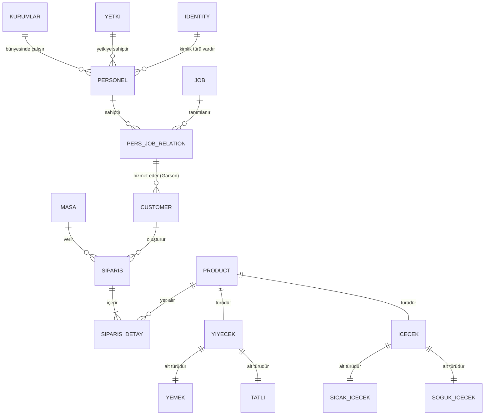

# EER_vs - Restoran Yönetim Sistemi Proje Dokümantasyonu

**Ders:** Veritabanı Yönetim Sistemleri
**Tarih:** 01.01.2026

## 1. Proje Özeti ve Amacı

Bu proje, modern bir restoranın sipariş, personel, menü ve stok yönetimini dijitalleştirmek amacıyla geliştirilmiş kapsamlı bir **Veritabanı Yönetim Sistemi** uygulamasıdır. Proje, ilişkisel veritabanı tasarımı prensiplerine uygun olarak normalizasyon kuralları çerçevesinde tasarlanmış PostgreSQL veritabanı üzerine inşa edilmiştir.

Sistemin temel amaçları şunlardır:
- **Veri Bütünlüğü:** İlişkisel yapılar ve kısıtlamalar (Foreign Key, Check Constraints) ile verinin tutarlılığını sağlamak.
- **Otomasyon:** Tetikleyiciler (Triggers) ve Saklı Yordamlar (Procedures) kullanarak garson performans takibini otomatikleştirmek.
- **Raporlama:** Görünümler (Views) ve karmaşık SQL sorguları ile yöneticiye anlık satış ve personel performans raporları sunmak.

## 2. Kullanılan Teknolojiler

- **Veritabanı:** PostgreSQL (İleri seviye SQL nesneleri kullanımı)
- **Backend:** Node.js, Express.js (RESTful API mimarisi)
- **Frontend:** HTML5, CSS3, Vanilla JavaScript (Kullanıcı arayüzü)
- **Bağlantı Katmanı:** `pg` (node-postgres) kütüphanesi

---

## 3. Veritabanı Tasarımı ve Şema

Veritabanı, 3. Normal Form (3NF) kurallarına uygun olarak tasarlanmıştır. Tekrarlanan veriler önlenmiş ve ilişkiler mantıksal olarak yapılandırılmıştır.

### 3.1. Varlık-İlişki (E-R) Yapısı

Sistemdeki temel varlıklar ve aralarındaki ilişkiler aşağıdadır:



### 3.2. Tablo Tanımları

1.  **Ana Tablolar:**
    *   **`kurumlar`**: Restoran şubelerini tutar. (`kurum_id`, `kurum_adi`, `gelir`)
    *   **`yetki`**: Personel yetki seviyelerini (Admin, Personel vb.) tanımlar.
    *   **`identity`**: Kimlik türleri (TC, Pasaport vb.).
    *   **`job`**: İş tanımları (Garson, Aşçı, Müdür).
    *   **`masa`**: Restoran masaları.
    *   **`product`**: Tüm ürünlerin temel bilgilerini tutar (`id`, `name`, `price`).

2.  **İlişki ve İşlem Tabloları:**
    *   **`personel`**: Çalışan bilgileri. `kurum_id`, `yetki_id` ve `identity_id` ile diğer tablolara bağlanır.
    *   **`pers_job_relation`**: Personel ve İş arasındaki N-M (Çoka-Çok) ilişkiyi yönetir ancak bu tasarımda bir personel bir işe atanarak özelleştirilmiştir. Ayrıca **`process_count`** alanı ile personelin gerçekleştirdiği işlem sayısı (performans metriği) burada tutulur.
    *   **`customer`**: Müşterileri temsil eder ve her müşterinin bir garsonu (`garson_id`) vardır.
    *   **`siparis`**: Sipariş başlığı (`table_id`, `customer_id`).
    *   **`siparis_detay`**: Siparişin içeriği (`siparis_id`, `product_id`, `adet`).

3.  **Kalıtım (Inheritance) Benzeri Yapı:**
    *   Ürünler hiyerarşik bir yapıda tutulmuştur. `product` tablosu ana tablodur. `yiyecek` ve `icecek` tabloları buradan referans alır. `yemek`, `tatli`, `sicak_icecek`, `soguk_icecek` tabloları da alt kategorileri oluşturur. Bu yapı, veri bütünlüğünü ve kategorizasyonu sağlar.

---

## 4. İleri Veritabanı Nesneleri

Proje, standart CRUD işlemlerinin ötesinde, veritabanı yönetim sistemlerinin güçlü özelliklerini kullanmaktadır.

### 4.1. Trigger (Tetikleyici): Otomatik Performans Takibi

**Senaryo:** Bir müşteri yeni bir sipariş verdiğinde, o müşteriye bakan garsonun işlem sayısının otomatik olarak artırılması gerekmektedir.

*   **Tetikleyici Adı:** `trg_update_process`
*   **Fonksiyon:** `update_garson_process()`
*   **Olay:** `siparis` tablosuna `INSERT` işleminden sonra (`AFTER INSERT`).
*   **Mantık:**
    1.  Tetikleyici, yeni eklenen siparişin kime ait olduğunu (`customer_id`) bulur.
    2.  O müşteriye atanan garsonun ID'sini (`garson_id`) `customer` tablosundan çeker.
    3.  `pers_job_relation` tablosundaki ilgili garsonun `process_count` değerini 1 artırır.

```sql
CREATE TRIGGER trg_update_process
AFTER INSERT ON siparis
FOR EACH ROW
EXECUTE FUNCTION update_garson_process();
```

### 4.2. Stored Procedure (Saklı Yordam): Manuel İşlem Artırma

**Senaryo:** Yönetici, gerektiğinde bir personelin işlem sayısını manuel olarak artırabilmelidir. Triggerlar otomatik çalışırken, prosedürler isteğe bağlı çağrılır.

*   **Prosedür Adı:** `increase_process(p_id INT)`
*   **İşlev:** Belirtilen `pers_job_relation` ID'sine sahip kaydın işlem sayısını artırır.
*   **Kullanım:** Uygulama arayüzünden "İşlem Artır" butonuna basıldığında çağrılır.

```sql
CREATE OR REPLACE PROCEDURE increase_process(p_id INT)
LANGUAGE plpgsql
AS $$
BEGIN
    UPDATE pers_job_relation
    SET process_count = process_count + 1
    WHERE id = p_id;
END;
$$;
```

### 4.3. View (Görünüm): Detaylı Personel Raporu

**Senaryo:** Personel listesi çekilirken; yetki adı, kurum adı, iş adı gibi bilgilerin her seferinde tekrar tekrar `JOIN` ile bağlanması performans kaybı ve kod karmaşası yaratır.

*   **View Adı:** `v_personel_detay`
*   **İşlev:** `personel`, `kurumlar`, `pers_job_relation` ve `job` tablolarını birleştirerek (JOIN) sanal bir tablo oluşturur.
*   **Fayda:** Sorguları basitleştirir (`SELECT * FROM v_personel_detay`).

### 4.4. Fonksiyon ve Cursor Kullanımı

*   **`add_product` Fonksiyonu:** Ürün ekleme işlemini kapsüller. Parametre olarak isim ve fiyat alır.
*   **`cursor_personel` Fonksiyonu:** (Örnek amaçlı) `CURSOR` yapısını kullanarak personel tablosunda satır satır gezinmeyi gösterir. Büyük veri setlerinde belleği verimli kullanmak için önemlidir.

---

## 5. Uygulama Mimarisi ve API

Uygulama, **Single Page Application (SPA)** mantığına yakın, sekme tabanlı bir yapıdadır. Backend, frontend'den gelen istekleri RESTful API standartlarında karşılar.

### 5.1. Backend (server.js)
Express.js sunucusu aşağıdaki temel API noktalarını (Endpoint) sunar:

*   **GET /api/products**: Menüdeki tüm ürünleri listeler.
*   **POST /api/products**: Yeni ürün ekler (Transaction yapısı kullanılarak birden fazla tabloya güvenli kayıt atar).
*   **GET /api/personel**: `v_personel_detay` view'ını kullanarak personel listesini döndürür.
*   **POST /api/siparisler**: Yeni sipariş oluşturur. Bu işlem `trg_update_process` tetikleyicisini harekete geçirir.
*   **POST /api/personel/increase-process**: `increase_process` prosedürünü çağırır.
*   **GET /api/raporlar/urun-satis**: `GROUP BY` ve `SUM` fonksiyonları ile en çok satan ürünleri raporlar.

### 5.2. Transaction (İşlem) Yönetimi
Veri tutarlılığı için "Hepsi ya da Hiçbiri" (ACID) prensibi uygulanmıştır.
Örneğin, yeni bir ürün eklenirken:
1.  `BEGIN` ile işlem başlatılır.
2.  `product` tablosuna kayıt eklenir.
3.  Ürün türüne göre (`yiyecek` veya `icecek`) ilgili alt tabloya kayıt eklenir.
4.  Hata olursa `ROLLBACK` ile tüm işlemler geri alınır, başarılıysa `COMMIT` ile onaylanır.

---

## 6. Kurulum ve Çalıştırma

1.  **Veritabanı Kurulumu:**
    - PostgreSQL'de `ERR_Cafe` adında bir veritabanı oluşturun.
    - `sql tablolar.txt` içeriğini çalıştırarak tabloları oluşturun.
    - `trigger.sql` ve `view_update.sql` dosyalarını çalıştırarak tetikleyici ve görünümleri tanımlayın.
    - `sql temel eklemeler.txt` ile başlangıç verilerini yükleyin.

2.  **Uygulama Başlatma:**
    - Terminali açın ve proje klasörüne gidin.
    - Gerekli paketleri yükleyin: `npm install`
    - Sunucuyu başlatın: `node server.js`
    - Tarayıcıda `http://localhost:3000` adresine gidin.

3.  **Kullanım Senaryoları:**
    - **Menü Yönetimi:** Yeni yemek veya içecek ekleyin.
    - **Sipariş:** Müşteriler menüden ürün seçip sepete ekleyerek sipariş verir.
    - **Garson Takibi:** "Personel" sekmesinden garsonların işlem sayılarını izleyin. Sipariş verildiğinde bu sayının otomatik arttığını gözlemleyin.

---
**Hazırlayan:** [Adınız Soyadınız]
**Öğrenci No:** [Numaranız]
